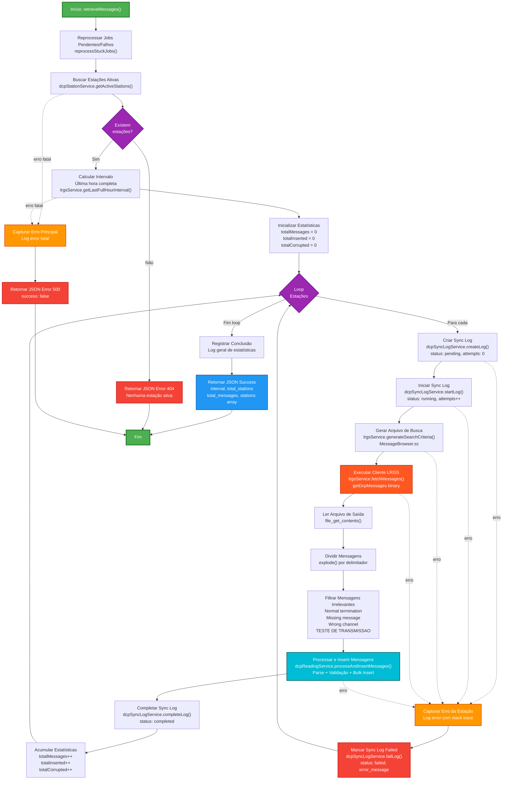

# Fluxograma: retrieveMessages DCP

## Fluxo Principal

## Detalhamento do Processo

### 1. Reprocessar Jobs
- Busca logs com status: `pending`, `failed` ou `running` > 10min
- Limite de 3 tentativas (attempts < 3)
- Deleta leituras antigas antes de reprocessar

### 2. Loop de Estações
- Para cada estação ativa no banco
- Cria um sync log (status: pending)
- Inicia processamento (status: running)

### 3. Busca LRGS
- Gera arquivo MessageBrowser.sc com critérios
- Executa cliente LRGS (getDcpMessages)
- Salva resultado em arquivo temporário

### 4. Processamento
- Divide mensagens por delimitador
- Filtra mensagens irrelevantes:
  - Normal termination
  - Until time reached
  - Missing message
  - Wrong channel
  - TESTE DE TRANSMISSAO

### 5. Inserção
- Parse do header GOES DCS (37 bytes)
- Validação de corrupção
- Mapeamento para campos do banco
- Bulk insert (todas mensagens válidas de uma vez)

### 6. Finalização
- Atualiza sync log (status: completed)
- Acumula estatísticas
- Retorna JSON com resultados
